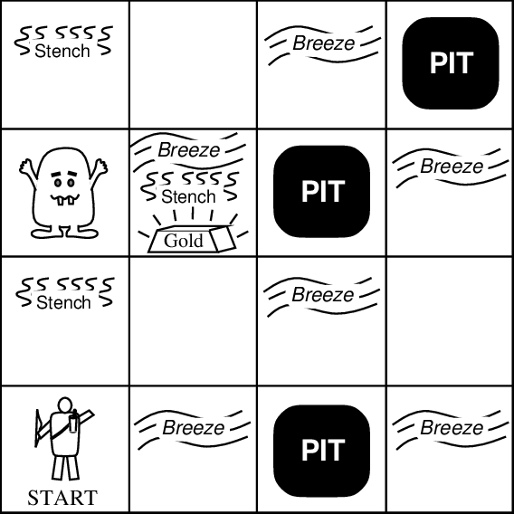
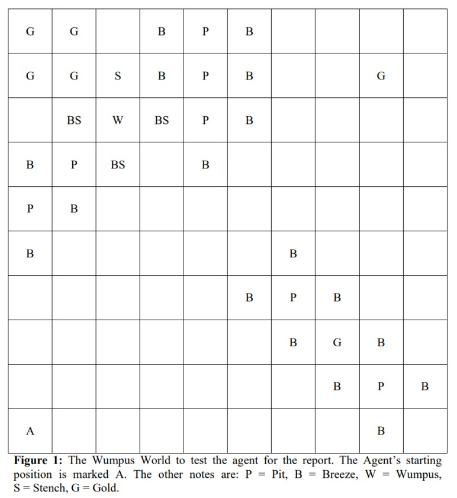

- Course: Artificial Intelligence - HCMUS  
- Contributors:
  * [Nguyễn Hoàng Nhân - 18127017](https://github.com/hoangnhan1105)
  * [Trần Thanh Tâm - 18127268](https://github.com/TranThanhTamBuu)

<h1 align='center'>PROJECT 2 - WUMPUS WORLD</h1>

## Description
The purpose of this project is to design and implement a logical search agent and AI agent for a partially-observable environment. This will be accomplished by implementing an agent that navigates through the Wumpus World.

The basic properties of the Wumpus World are described in the textbook (Artificial Intelligent: A Modern Approach).

In summary, it is a game with:
- 2D cave connected by passages.
- Some rooms contain a pit into which we fall and perish.
    - We feel a breeze if near a pit.
- One room contains a Wumpus that will eat us.
    - We have one arrow that we can shoot in the direction we are facing.
    - We smell a stench if near the Wumpus.
- Somewhere, there is a pot of gold.
- We can move forward or backward, turn left by 90 degrees or right by 90 degrees.
- Find gold (if possible) and try and kill the Wumpus.

## New Wumpus World

We will modify the Wumpus world as such:
- The world will be limited in **10x10 instead of 4x4**. Room (1,1) will still be the bottom-left one, and Room (10,10) the top-right one. First number is room position in horizontal coordinate and second number is room position in vertical coordinate.
- Agent can **appear in any** Room (xa, ya) and always **facing to the right**. This room is the only room have the cave door. 
- There may be **any number of pits and gold** in the world. 
- There is **at least one Wumpus**.
- The agent carries an **infinite number of arrows**.
- The game will end when **one of the following three conditions** occurs:
    1. The agent dies
    2. The agent kills all of the Wumpus AND grabs all the gold
    3. The agent climbs out of the cave

The scores are as such:
- Add 100 points for picking up each gold.
- Reduce 100 points for shooting an arrow.
- Reduce 10000 points for dying (by being eaten by the Wumpus, falling in a pit).
- Add 10 point for climbing out of the cave.
- Reduce 10 points for moving from one room the the next.

Example:

## Tasks

Your group must implement code to explore the Wumpus World and get the highest score possible, using either Propositional Logic or First-Order Logic (or both).

Your implementation should output information about the search, including the precepts at every room the agent enters, the content of or change in the knowledge base after each new precept, and the action decided upon by the agent. The program should also output the score of the agent.

Having your implementation generate Wumpus Worlds randomly can help you test your agent. However, it must also be able to load the world setup of Figure 1.

[Full assignment](Documents/CSC14003-Project02.pdf)